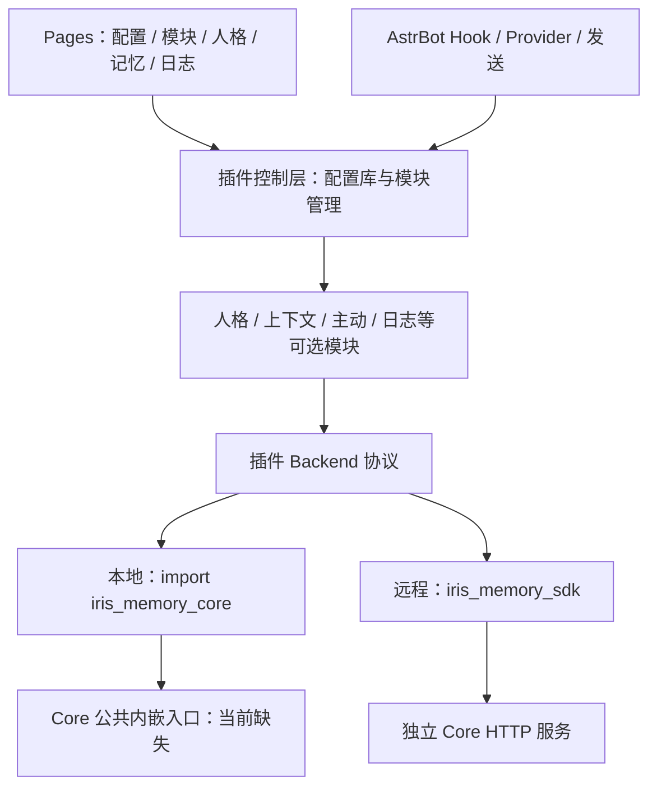

# Iris Memory v4 技术路线、落地标准与实施指南

> 状态：按项目负责人最新要求修订的目标设计；尚未实现或验收。
>
> 修订日期：2026-09-06。开发分支：`dev.4`。定位：低成本、轻量级 AstrBot 插件。
>
> 本项目实施范围仅为 `astrbot_plugin_iris_memory`。Core 与 SDK 只读核查、作为外部依赖消费；发现缺口先告知用户，不自行修改。

本文取代上一版中“同时实施 Core 双模式改造、将 SDK 并入 Core 包、以 AstrBot 人格为编辑来源”的安排。v4 从零建立插件，v3 主线仅作功能、兼容行为和回归案例参考。本文中的目录、配置、API 和资源预算除明确说明外均为待实施设计，不代表当前可用功能。

## 导航

- [1. 最新要求与范围](#scope)
- [2. 核查基线与 Core 缺口](#baseline)
- [3. 总体架构与依赖边界](#architecture)
- [4. Schema 与 Pages 配置管理](#configuration)
- [5. 模块划分与热加载](#modules)
- [6. 轻量化、内存与模型成本](#resources)
- [7. 插件完整人格管理](#persona)
- [8. 本地与远程 Backend](#backends)
- [9. 统一记忆、身份与数据](#memory)
- [10. 检索与上下文](#context)
- [11. 主动回复与任务](#proactive)
- [12. 可选完整运行日志](#logging)
- [13. Pages、工具与运行状态](#pages)
- [14. 从零构建的目录与阶段](#implementation)
- [15. 验收标准](#acceptance)
- [16. 数据迁移与兼容](#migration)
- [17. Core 变更告知流程](#core-changes)
- [18. 开发指南与参考来源](#references)

<a id="scope"></a>

## 1. 最新要求与范围

### 1.1 不可偏离的约束

| ID | 用户要求 | 本版落地规则 |
| --- | --- | --- |
| R-01 | dev.4 从零构建 | 不依赖分支中残留的 v3 文件；需要参考时只读主线，不整包复制旧结构 |
| R-02 | 配置迁入 Pages | `_conf_schema.json` 仅保留 Core 本地/远程选择；其他配置都由 Pages 配置子页面管理 |
| R-03 | 延续轻量实现、小内存 | 复用宿主能力，插件用 SQLite；有界缓存/队列，按需初始化，无额外服务器 |
| R-04 | 人格完全归插件 | 插件持有人格数据、版本和绑定，提供全部管理/演进流程；AstrBot 不作为日常人格编辑源 |
| R-05 | 模块化、按需热加载 | Pages 控制模块开关；支持运行中启停、重配置、失败回滚与资源释放 |
| R-06 | 可选完整运行日志 | 开启后覆盖插件全流程、错误与关联 ID，支持查询/导出/实时查看；默认不持久化详细日志 |
| R-07 | 更优方案涉及 Core 时提前告知 | 先说明缺口、拟改范围、收益和兼容影响，取得明确同意后才可进入单独 Core 任务 |
| R-08 | 低成本轻量定位 | 默认后台模型加工和主动发起关闭；规则先行，按需检索，共用预算与 worker |
| R-09 | Core 与 SDK 分发边界 | 本地依赖并 import `iris_memory_core`；远程使用独立 `iris-memory-sdk` / `iris_memory_sdk` |
| R-10 | 本项目只改插件 | Core 未实现/不完整的内容列为外部缺口，不自动修补，也不把 SDK 改造塞入插件任务 |

第 11、12 项原消息未提供内容，本文不推断新增要求。

五个原始痛点继续作为功能验收方向：

| 痛点 | v4 的具体改变 | 主要落地章节 |
| --- | --- | --- |
| 主动行为与记忆割裂、流程复杂 | 主动/被动共用人格、Recall、上下文和发送；Focus、用户 Task、技术 Job 各司其职 | 9–11 |
| 记忆过度拆分、重复存储 | Core 保有唯一长期事实来源，插件只存自身配置/人格/交付；近期缓存与学习样本引用相同来源 | 3、9 |
| 注入多处截断、魔法参数多 | 一个 ContextBuilder 计算动态预算，配置描述集中，完整单元选择与省略原因可见 | 4、10 |
| 检索质量不足 | 先测现有混合检索，改善中文实体/时间/纠正与去重；需要引擎调整时报告 Core 缺口 | 10、15、17 |
| 人格管理割裂 | 插件统一编辑、版本、绑定、发布、学习与采用；Core 只在需要时保留明确版本的镜像 | 7 |

### 1.2 交付边界

- `iris_memory_core` 项目负责 `iris-memory-core` 的 pip 包、服务端、内部存储/索引和 Phase 14 发布工作。
- `iris-memory-sdk` 是独立远程协议客户端，import 名为 `iris_memory_sdk`，不并入 Core，也不复制到插件。
- 本插件按 AstrBot 插件目录形态组织代码和 Pages，不建立本插件自己的 wheel/sdist、PyPI 发布链或新的 SDK 发行包。
- 插件可声明依赖版本并验证消费，不能将“依赖安装成功”当作 Embedded API 已实现。
- 本轮只修订本文件。后续实现也默认只发生在插件仓库，不因文档提出优化就授权修改 Core、SDK 或 AstrBot。

### 1.3 从零构建与主线参考

用户已指定清空后的 `dev.4` 作为构建起点。实施以这一目标为准，不以旧组件“还存在”为依赖条件；先交付新目录、入口、配置和测试。

2026-09-06 本工具视图仍可见旧文件，且实际本地分支为 `dev.4`、`master`，没有 `main`。这属于工作区核查差异，不是恢复旧实现的理由。本指南将用户所称 `main` 统称“主线”；参考前用 `git branch -a` 解析实际 ref，再以 `git show <ref>:<path>` 只读查看。不得为查资料切换分支、恢复清空文件或覆盖用户变更。

<a id="baseline"></a>

## 2. 核查基线与 Core 缺口

### 2.1 当前可参考的能力

v3 已有近期缓冲/总结、SQLite + FAISS、FTS5 trigram/BM25 + RRF、画像/图谱、记忆纠正遗忘、主动回复、表达学习、人格演进和管理日志。参考重点是产品行为和已解决的边界问题：索引修复竞争、Outbox、作用域、发送回填、发布冲突等；不重建原有多库、多窗口和多套预算结构。

| v3 功能面 | v4 保留的用户能力 | 新实现的归属与取舍 |
| --- | --- | --- |
| 近期消息、引用、摘要 | 群聊背景、最近话题、引用关系可用于本轮回复 | memory/context，共用来源与预算；不复制旧多窗口结构 |
| 长期记忆、画像、关系 | 写入、查找、详情、纠正、遗忘和来源解释 | Core 公共能力 + 插件工具/Pages；不另建插件事实库 |
| 主动回复 | 跟话、跟进、主动发起和选择不发言 | proactive，同一回复流程；默认关闭，先做简单门控 |
| 图片和平台消息 | 图片描述、引用、平台身份与发送差异 | media/adapters，按能力加载；不默认加载本地大模型 |
| 表达学习、暗语、人格演进 | 允许的样例、候选审核、人格更新与回滚 | learning/persona；共用证据，插件管理发布 |
| 管理指令与模型工具 | 用户能够查、记、改、忘及管理插件 | tools/Pages；逐项列旧名称到新操作的映射，不默默删除入口 |
| Dashboard、日志与统计 | 配置、状态、错误排查、调用与成本可见 | 统一到 Pages，日志和成本计数无需额外模型 |
| Dream、维护、备份 | 可选整理、清理、恢复所需的数据保障 | maintenance；复用已有公共操作，未支持的备份/导入明确列差异 |

M0 从主线逐项补齐命令、工具名、平台与场景的“保留/替换/暂缓”映射及回归案例。上表不是这些能力已在 v4 完成的声明；稳定候选必须公布覆盖矩阵，不能以从零构建省略功能差异。

Core 已有 Observation、Claim/Episode/Relation、State/Focus、Note/Task/Event、Persona、FTS/Vector/Graph、画像、修订和删除规则。组件存在不代表当前安装物或 HTTP 入口已经正确装配。

核查快照：

- 插件主线历史基线：`b752ffbf1ccaab35bf6708015be5dc5405643775`，另有用户工作区修改；不作为 v4 已实现代码。
- Core HEAD：`692de12b4b9a9d8d47ebfdd938ba9622d152f0d9`，另有用户修改的 Phase 14 等文档。包版本 `0.12.0`，独立 SDK `0.11.0`。
- AstrBot 本地源码：`08d0b1f74f062b9883032363816ba75e7cedb4e3`，声明 `4.27.3`、Python `>=3.12`。这是参考版本，最低支持版本仍需实测。

文档终检期间 Core 工作区出现并发修改，包括 ADR-0023、安装资源解析、wheel 资源声明及 Console ID 契约修正。本任务没有写入这些文件。下面区分历史失败、已见源码修复和未取得的验收证据；消费前应以届时安装物重新确认，不能仅凭未提交改动关闭缺口。

### 2.2 已确认的外部缺口

以下只读核查结果必须向用户说明；全部属于 Core/SDK 项目的待处理依赖，不是本插件被授权实施的任务。

| ID | 当前事实与证据 | 对 v4 的影响 | 插件侧处理 |
| --- | --- | --- | --- |
| C-01 | Core 根模块只导出版本；最新 Phase 14 明确尚无冻结的进程内业务 façade，pip 当前提供服务/worker/CLI 与公共 HTTP 契约 | 本地 import 后直接运行记忆引擎尚不具备公共接入条件；用户目标与当前 Core 计划存在缺口 | 本地记忆显示 blocked；告知用户需要 Core 明确公共内嵌 API，禁止调用私有服务或启动 localhost 冒充本地 |
| C-02 | Phase 14 历史探针记录 wheel 迁移数为 0、契约加载 FileNotFoundError；终检已见 ADR-0023、force-include 和包资源解析等并发修复改动，尚未取得其安装验收结果 | 不能把旧失败写成永远未修，也不能仅凭源码改动宣布安装物可用 | 状态为外部修复/待验收；等待 Core 产物及消费证据，不向插件复制 SQL/Schema 来补包 |
| C-03 | HTTP 的 TransportRuntime 未向 Recall 装配 Vector/Graph；worker 默认确定性认知 Provider 和 32 维测试 Embedding | 不能宣称默认服务已有真实语义检索和生产提炼 | capabilities 加实际探针；标出未接入的检索通路，不用空数组伪装无命中 |
| C-04 | Provider port 多为同步；没有已冻结的宿主异步注入、资源所有权与无重复 worker 生命周期 | 本地异步接入、热停和小内存尚待验证 | 列为 C-01 的验收前提，不使用嵌套事件循环或私有线程桥接偷渡 |
| C-05 | SDK 用 urllib + asyncio.to_thread，只有客户端级超时；无连接池、真实传输取消、SSE 和逐请求 deadline | Remote 可做有界消费，但不能承诺取消后底层请求已停止或瞬时无连接残留 | 限制在途数、保留结果未知状态并有界排空；需要更强保证时报告 SDK 缺口 |
| C-06 | manifest 为 Schema 14/包 0.12.0，capabilities 契约源仍为 Schema 11/包 0.11.0，HTTP 元数据也有漂移 | 版本协商不能仅信一个静态字段 | 比较安装版本、协商响应和受权业务探针，不兼容模块 blocked |
| C-07 | Phase 13 Console 读面/类型有历史失败，终检已见 ADR-0023 的 ID 契约及前端修复；完整管理写入、导入导出、Provider/Settings 仍需逐项验收；SDK 不覆盖 /console/v1 | 部分修复不代表全部管理闭环，不能声称 SDK 已可完成全部远程管理/迁移 | 插件本身配置独立存储；Core 数据管理按已存在的公共方法逐项启用 |
| C-08 | Core 已有权威 Persona/Agent 就绪规则和演进策略，与“插件自主管理人格”的新要求需要明确同步协议 | 需要单向镜像、版本关联与权限验证，不能默认关闭 Core 校验 | 用已有公共 Persona 方法核验可行性；不足则告知，不自动改 Core 规则 |

C-02 与 Console 历史失败来自 Core Phase 14 中记录的实际探针；并发修复的范围参考 ADR-0023。本轮未重跑构建、模型或服务测试，不把旧记录或新增测试文件冒充本次通过结果。Core Phase 11/12 最新已 Deferred，移出 Core pip 发布门禁；本插件不恢复这两个阶段，也不要求 Core 携带 AstrBot 适配代码。

### 2.3 不阻塞所有插件工作的安排

C-01 阻塞本地记忆正式接入，不阻塞 Pages、配置、模块管理、插件人格、日志与预算设施。可先使用测试 Backend 验证插件编排，Remote 使用现有 SDK 做受限联调；测试替身必须标为测试，不能出现在生产列表充当可用本地 Core。

稳定版的本地/远程能力应分别验收。外部缺口未关闭时，展示明确的 blocked/degraded 与需要用户决策的事项，不以接口脚手架宣布双模式完成。

<a id="architecture"></a>

## 3. 总体架构与依赖边界



插件始终只有一个轻量控制层：Pages API、配置库、模块状态、基础身份和能力诊断。业务模块按需加载，Backend 也按实际引用加载；记忆关闭时不应仅为页面展示初始化 Core 或 SDK。

| 内容 | 权威/实现位置 |
| --- | --- |
| 插件配置、模块开关、人格/版本/绑定、插件交付日志 | 插件的轻量 SQLite 与轮转日志文件 |
| 长期记忆、画像投影、索引、Core Task/Focus、领域 Scope/删除 | Core 公共方法背后的唯一实现 |
| 平台身份映射、Prompt、发言决定、平台限额、实际发送 | 插件适配与编排，复用 AstrBot |
| Core 配置/索引算法/迁移/包分发 | 外部 Core 项目；本任务只提出需求和核查 |
| 远程传输实现和 SDK 分发 | 外部 iris-memory-sdk；插件只包装公共方法 |

配置和人格属于插件自身产品数据，允许本地 SQLite 持久化；Remote 模式不能再存一份供检索的长期记忆库或向量索引。只允许有界交付队列和带有效期的视图缓存。

<a id="configuration"></a>

## 4. Schema 与 Pages 配置管理

### 4.1 `_conf_schema.json` 的唯一职责

Schema 只暴露本地/远程选择。目标示例如下，遵循 AstrBot 配置格式；该文件在从零构建阶段创建，不在本次文档修改中生成。

```json
{
  "core_mode": {
    "type": "string",
    "description": "Core 运行方式",
    "options": ["local", "remote"],
    "default": "local",
    "hint": "其他设置在 Iris Memory Pages 的配置管理中完成"
  }
}
```

远程 URL/凭据、模型、预算、模块开关、人格、日志等不进入 Schema，不保留 hidden_config.json 或第二套页面覆盖配置。Pages 可以显示当前模式并提示到 AstrBot 配置入口切换，不在 SQLite 中再保存一个可独立编辑的 core_mode。

Core 模式属于启动依赖选择，修改后走受控 Backend 重建或 AstrBot 插件重载；不承诺切换模式能迁移数据。各业务模块的启停和普通配置在 Pages 内热生效，两者区别需在界面明确。

### 4.2 Pages 接入方式

采用一个稳定入口 `pages/iris/index.html`，内部设置“配置管理”等子页面，例如 `#/settings`、`#/modules`、`#/personas`、`#/logs`。模块启停不动态增删 Page 目录。

按本地 AstrBot Pages 文档与代码：

- Page 是受限 iframe，通过 `window.AstrBotPluginPage` bridge 调用插件 API。
- 等待 `bridge.ready()`；调用 `apiGet`、`apiPost`，上传下载和可选 SSE 使用 bridge 提供的方法。
- 后端使用 `context.register_web_api()` 与 `astrbot.api.web` 的 request/json_response/error_response 等公共适配层。
- 路由包含插件名，前端 endpoint 仅使用插件内相对路径；不直接跨源请求 Core 或访问父窗口 Cookie/LocalStorage。
- 新增/删除 Page 目录需要宿主重载；功能模块热启停不等于修改静态 Pages 发现结果。

外部依据：[AstrBot Pages 文档](https://docs.astrbot.app/dev/star/guides/plugin-pages.html)、[插件配置文档](https://docs.astrbot.app/dev/star/guides/plugin-config.html)。页面仅使用宿主桥接；本插件不额外启动 Quart/FastAPI 服务或 Node 开发服务器。

### 4.3 配置存储与更新

插件持久目录使用一个 `plugin.sqlite3` 保存 settings、settings_revision、module_desired_state、persona/revision/binding、必要交付记录。可有分表和索引，不为每个模块再开数据库和常驻连接池。数据目录从 AstrBot 公共持久路径获取，不写源码目录。

所有配置项定义类型、单位、范围、默认值、生效模块及 `live/restart-module/reload-plugin` 级别。页面字段来自同一配置描述，不把默认值散落到前端、后端和旧隐藏参数中。

保存流程：读取当前 Revision → 提交 Expected Revision 与变更 → 后端类型/权限/交叉规则校验 → 形成 pending 配置 → 模块执行有界应用 → 持久化有效版本并回报结果。失败保留上一个有效配置，记录失败原因；不能返回 saved 就误导用户已经热生效。崩溃恢复区分 pending 与 effective，重新对账。

多个配置页同时修改发生冲突时返回明确 Revision 冲突。模块状态同时显示 desired、effective、reason 和运行 generation，避免“开关已开但未启动”被隐藏。

### 4.4 Pages 配置分类

| 子组 | 内容 |
| --- | --- |
| Core 连接 | 只读当前模式、Remote URL/凭据、超时、连通性、依赖/能力诊断；本地数据状态 |
| 模块 | 开关、依赖、配置/运行状态、启停失败与重试 |
| 模型与成本 | 从宿主读取允许的 Provider ID/名称、后台预算、调用频率；不返回宿主模型密钥 |
| 记忆与上下文 | 会话范围、共享策略、保留、候选/上下文预算 |
| 主动行为 | 启用范围、静音、冷却、提醒补发窗口、频率 |
| 人格 | 完整创建/编辑/导入/导出、版本、绑定、学习策略、发布/回滚 |
| 运行日志 | 开关、级别、正文诊断选项、容量/保留天数、实时订阅和导出 |

凭据只接受后端保存，读取返回 mask/存在标志；不存浏览器持久存储，不放到日志。优先使用环境/凭据引用；需要本地保存时限制文件访问并明确其保护能力，不虚称明文 SQLite 等于加密保险箱。

未选 Provider、Remote 连接未填或本地入口缺失时，Pages 与配置库仍可用。对应业务模块保持待配置/blocked，不让用户因配置不完整无法进入设置页面。

<a id="modules"></a>

## 5. 模块划分与热加载

### 5.1 模块清单

| 模块 | 职责 | 默认启动策略 | 依赖 |
| --- | --- | --- | --- |
| control | Pages API、配置、模块管理、基础错误报告 | 必需且轻量常驻 | 插件 SQLite |
| memory | 观察、记忆工具、Core Recall/画像读取 | 首次安装待配置；用户启用且依赖满足后启动 | 选定 Backend |
| context | 近期补充、去重、动态预算、临时注入 | 随记忆配置显式启用 | memory；不强制 persona |
| persona | 完整人格和绑定、Prompt 采用、版本 | 用户首次设置后启用 | 插件 SQLite；不强制 Core |
| proactive | 跟话/跟进/主动发起/关注 | 默认关闭 | context、memory；使用所选人格来源 |
| learning | 表达样例、风格提炼、人格候选 | 默认关闭 | persona；证据读取需 memory |
| media | 图片描述和附件规范化 | 默认关闭 | 宿主相应 Provider；输出交给 memory |
| maintenance | 请求 Core 已公开的维护操作、插件本地清理 | 高成本操作默认关闭 | 对应业务模块和能力 |
| diagnostics | 结构化完整运行日志与实时流 | 默认关闭 | 有界日志设施 |

模块清单为职责边界，不要求每一行引入复杂基类/独立线程。管理控制层无法在自身 Pages 内关闭；停用整个插件由 AstrBot 管理。页面功能可用性与业务开关分开：记忆模块关闭时仍能查看为何关闭和修改配置。

### 5.2 按需加载标准

控制层只读取模块描述和轻量工厂引用。关闭的业务模块不 import 重依赖、不打开存储/索引、不分配大缓存、不调用模型、不创建后台循环。Local/Remote Backend 只在至少一个活动业务模块需要时构造。

轻量 Hook/API 分发入口可以随插件一次注册，通过模块管理器取当前有效实例；关闭模块时入口返回 module_disabled。真正业务实现和资源按需实例化。按需加载不要求强制从 sys.modules 删除包，也不修改其他插件共享的已导入 Core/SDK 模块。

### 5.3 状态机与依赖

```text
disabled → starting → enabled → stopping → disabled
               ↘ failed / blocked
enabled → reconfiguring → enabled（成功）或保留原有效配置（失败）
```

开启模块前检查依赖和能力；缺依赖返回明确说明，可在 Pages 一次明确启用所需模块，不能静默启动高成本功能。关闭被依赖模块时默认拒绝并列出依赖者，或由用户一次操作明确选择依赖级联关闭。

每个模块启停和重配置串行化。为实例分配 generation，异步结果、计时器和发送意图必须验证仍属当前 generation；旧实例结束后的回调不能污染新状态。

### 5.4 热启停流程

- **开启：** 校验配置/权限/依赖 → 创建自有资源 → 有界探测 → 发布有效实例 → 注册内部订阅/任务 → 回报 enabled。失败逆序清理，不遗留半启动 worker。
- **关闭：** 拒绝新业务 → 注销内部订阅/计时器 → 阻止尚未提交发送的操作 → 排空或记录有界在途工作 → 保存进度 → 释放资源 → disabled。
- **重配置：** 可动态替换的策略使用不可变快照；需要新资源时有界重建，失败继续旧有效实例或明确 blocked；内存不足时先停后启，不能默认双份加载索引。
- **热更新代码：** 仍交由 AstrBot 插件 reload。运行中开关模块是插件自身生命周期，不通过反复卸载整个插件实现。

宿主共享 Provider、全局工具管理器和事件循环不归模块所有。关闭仅释放自有对象。SDK 缺真实取消时记录 stopping/在途，等待其已声明超时和上限，不能提前报告所有底层连接已释放。

### 5.5 工具与 Hook

当前 AstrBot 支持添加工具/注册 Web API，整插件 reload 有自己的清理流程；这不等于框架提供任意子模块热卸载 API。

工具可一次注册轻量代理，每轮仅向 req.func_tool 暴露活动模块工具，并在执行时二次检查 generation/权限。没有公开移除接口时不直接修改宿主私有全局 registry。已暂停的工具调用返回明确状态，不能执行旧实例。

所有后台 task、订阅、文件句柄和缓存有实例所有者，避免每个模块自建循环轮询、日志线程与 Provider 池。关闭 Page 订阅只停止浏览器流，不擅自关闭用户已开启的业务模块。

<a id="resources"></a>

## 6. 轻量化、内存与模型成本

### 6.1 技术选择

插件使用 Python 标准库 sqlite3、asyncio、logging 等和 AstrBot 已提供的能力。数据库工作短事务化，在合适的有界执行路径运行，避免锁住事件循环；不引入 Redis、外部图数据库、独立向量服务或通用分布式调度。

本地记忆的 SQLite/FAISS 属于 Core，插件只消费 API，不自己重建向量引擎。Remote 不初始化 NumPy/FAISS 或本地 Runtime。不在插件中加载/下载大语言模型或 sentence-transformers/torch；模型调用复用宿主或服务端 Provider。

Pages 使用静态 HTML/CSS/JS，优先原生模块与小型组件；需要构建时只交付静态结果，避免大型图表/编辑器默认加载。长列表分页、虚拟显示，日志滚动有上限。

### 6.2 内存预算与测量口径

以下是待实测后冻结的初始目标，不是已达到的测量值。使用同一 AstrBot 版本、同负载、同 Provider 条件，测量启用插件前后的进程 RSS/峰值，并用对象/句柄统计辅助解释。

| 项目 | 初始目标/控制方式 |
| --- | --- |
| 仅控制层，业务全关 | 插件增量 RSS 目标 ≤32 MiB；无模型调用/索引/业务 worker |
| Remote 普通负载 | 插件增量 RSS 目标 ≤64 MiB；Core 服务内存另列 |
| Local | 插件自身仍以 ≤64 MiB 增量为目标，Core 引擎/索引另测，同时报告宿主总 RSS；不能仅扣除 Core 后宣称整机轻量 |
| 会话/候选/图片描述缓存 | 统一字节上限与 LRU/TTL；初始共享预算 8 MiB，不能只限制每群条数而让群数量无限增长 |
| 日志待写/订阅缓冲 | 合计初始上限 1 MiB；正文不同时保留多份 |
| 队列与并发 | 队列同时限制任务数和负载字节；后台默认一个 worker，前台另有有限并发 |

向量原始内存约为 `N × dimension × 4 bytes`，不含索引结构和副本；例如 10 万条 768 维 float32 原始向量就约 293 MiB。Local 必须用声明规模测试总量，不能只凭 SQLite/FAISS 名称承诺小内存。若现有 Core 超出目标，先报告 C 类缺口与优化建议，不自行改变 Core 索引实现。

测试冷启动、稳态、多群、长文本、日志开启、50 次热启停与重配置峰值。关闭后缓存/worker/句柄应释放且重复循环无持续增长；Python/原生分配器可能不立即归还 RSS，不能通过一次 RSS 数值判定失败或成功，需同时确认无活引用和下一轮资源复用。

### 6.3 成本策略

- 关掉的模块模型调用为零；页面刷新、日志查询、状态展示不触发 LLM。
- 首次安装的高成本提炼、人格学习、主动发起全部关闭，启用时显示预算与依赖。
- 普通召回优先现有结构化/关键词/向量能力，不默认每轮查询改写、LLM rerank、多跳图或人格分析。
- 同一轮共享消息、Recall 和上下文结果；相同证据不为主动、画像、学习各调用一遍模型。
- 后台有每日调用/Token/耗时预算和最小间隔。预算耗尽暂停可选加工，保留进度；界面显示调用估算与实际使用，价格未配置时不虚构货币成本。
- 日志完整性、资源计数和常规诊断使用确定性代码，不用模型分析才能排查错误。

<a id="persona"></a>

## 7. 插件完整人格管理

### 7.1 唯一管理主体

人格模块在本插件中提供创建、编辑、克隆、导入/导出、版本、发布、回滚、删除/停用、会话绑定和学习审批。用户无需到 AstrBot 人格面板维护本插件人格，也不以 AstrBot Persona ID 作为唯一人格身份。

**插件 SQLite 中的 Persona 与不可变 PersonaRevision 是本插件人格的主记录。** Pages 选择 published Revision，绑定到用户/群/会话；每次回复记录实际采用版本和渲染 Hash。该设计替代上一版“Core published 为插件人格唯一权威、插件只维护 AstrBot 受控区块”的安排。

persona 模块能够在记忆关闭或 Core 不可用时独立管理并使用已发布人格。人格领域存储与长期记忆存储职责不同，不在插件镜像整个 Core 记忆库。

### 7.2 最小模型与行为

| 对象 | 必须保留的信息 |
| --- | --- |
| Persona | 稳定 plugin_persona_id、名称、状态、当前 published revision |
| PersonaRevision | 完整内容/结构、前驱、Hash、作者/原因、创建时间、候选/审核信息 |
| Binding | 稳定平台/会话范围、persona_id、优先级、版本跟随策略 |
| Adoption | 本轮实际 Revision、渲染器版本/Hash、会话与请求 ID |
| CorePersonaMirror | 可选的 Core agent/persona 标识、外部 Revision、最后同步的插件 Revision/Hash、状态 |

每次修改先形成草稿或候选，发布执行 Expected Revision 校验；回滚新建 Revision，不删除历史。删除被绑定人格必须先处理绑定。绑定优先级在配置中固定为会话规则 → 群/私聊规则 → 插件默认人格，并记录实际命中来源。

关闭 persona 模块不删除人格、绑定或会话历史，但必须撤下后续请求中的本插件人格。曾显式建立的宿主承载映射需记录原状态并通过公共接口恢复；存在外部编辑冲突时报告原因，不静默覆盖。重新开启采用当前有效绑定和已发布版本，不复用旧 generation 的 Prompt。

### 7.3 AstrBot 接入与双重人格防护

AstrBot 仍负责模型执行、系统规则、工具和技能权限。插件只管理自己负责的角色内容，不能覆盖宿主安全约束或扩展工具权限。

本地源码显示 `_ensure_persona_and_skills` 会追加所选人格与开场白；`resolve_selected_persona` 中会话强制规则优先于 conversation.persona_id。因此简单向 system_prompt 追加新人格、或仅把 conversation.persona_id 设为 `[%None]`，都不能证明彻底接管。

M0/M2 必须验证一个公开可维护的单一人格入口：由插件控制的空白承载 Persona/会话选择，或已证实有效的请求级人格替换方式。AstrBot 资源只作为执行承载，不作为主数据和日常编辑入口。插件维护完整 Prompt，不能只保留 `IRIS_EVOLUTION` 区块；也不能通过按文本匹配删除宿主规则来“接管”。

验收包括强制会话人格、WebChat 默认人格、开场白、技能/工具及后续 Hook，保证本插件人格只出现一次。缺公开接缝时明确标注宿主兼容阻塞，继续可做的人格编辑/版本功能，不 monkey patch AstrBot 私有函数，不自行修改宿主源码。

### 7.4 Core Persona 的位置

Core 当前要求某些 Agent/Recall 有有效 Published Persona。需要时通过既有公共管理方法把插件已批准人格单向同步为外部镜像，保留插件 Revision ↔ Core Revision 映射；插件仍决定内容、绑定与何时发布。

不得静默关闭 Core 的权限、Policy、Persona Ready 或版本校验。将 Core 自主演进保持 locked/显式受控，避免双方分别改人格。若外部管理员改了镜像，记录冲突，不自动覆盖本插件主记录，也不在不知道哪个版本实际采用时继续相关记忆操作。

发布插件人格、同步 Core 与宿主实际采用不是一个跨库事务。应用状态分别记录；Core 同步失败不伪造成功，可继续独立 persona 功能，依赖精确版本的记忆/主动模块按能力暂停。当前公共方法不能满足镜像语义时列入 C-08，提前告知用户。

### 7.5 学习与演进

learning 是可选模块，使用被允许的来源/样例，先筛选、脱敏、去重和均衡抽样，再生成风格/Persona 候选。编辑、审批和回滚都在 Pages；默认人工批准，受限自动批准需用户明确开启并设置预算/允许字段。

机器人核心身份/权限不因普通对话自动变化。表达样例、暗语、用户画像与人格是不同产物，共享证据引用，不复制多份原始群聊。来源被遗忘或撤权后，候选重新校验；已发布内容产生可审查修订，不能从过期样本重新学习回来。

<a id="backends"></a>

## 8. 本地与远程 Backend

### 8.1 安装与 import

| 模式 | 消费的外部发行物 | 插件调用 | 当前状态 |
| --- | --- | --- | --- |
| local | Core 项目的 `iris-memory-core` | 只 import `iris_memory_core` 已冻结公共 Python API | C-01 阻塞，当前只有版本导出不够 |
| remote | 独立 `iris-memory-sdk` | `iris_memory_sdk.AsyncIrisMemoryClient` 的公开方法 | 已有客户端，但存在 C-05/C-06 等限制 |

不提出 `[embedded,client]` 统一包或 SDK 迁入 Core 的安排，不要求本插件构建任何 Python 发行包。未来 Core 有哪些 extras 由 Core 的真实发布决定，本插件只声明经过消费验证的依赖。

AstrBot requirements 是安装期声明，不能假定根据运行时 core_mode 条件安装。基础 requirements 优先只含共同轻依赖，模式依赖提供版本化安装说明；若标准插件安装必须同时声明 Core/SDK，应明确“安装了但未导入”，验证依赖闭包并记录包体差异。运行时不静默 pip install，也不因模块热启停安装/卸载第三方包。

### 8.2 只做薄适配

Backend 对外统一插件需要的 observe、remember、recall、correct、forget、capabilities、task/focus 等语义。命名与字段映射复用现有契约；没有的方法明确 unsupported，不新增第二套记忆引擎。

Local 等待 Core 提供公开生命周期和业务 API 后接入。不得直接实例化内部 TransportRuntime/ApplicationService、打开 Core DB/FAISS、复制迁移文件，或在本地启动 HTTP/sidecar。Remote 只调用 SDK 公共方法；不访问 `_request_json`，不另写一个绕过 SDK 的 HTTP 引擎冒充使用 SDK。

本地 Provider 适配器属于插件，只有 Core 公共入口支持注入后才把宿主 LLM/Embedding 转为该契约；资源所有权、取消、并发与宿主共享实例必须明确。Remote 的记忆提炼和 Embedding 通常由服务端独立配置，Pages 管理插件自身的 Provider 选择，不能承诺替代尚未实现的 Core Settings API，也不自动复制宿主凭据或让服务端回调 AstrBot。

需要的公共操作存在但返回 dict 时，可在插件适配层做最小结构验证/映射；这不改变服务端契约。能力缺失只阻塞相关模块，Pages 显示原因和可能的替代功能。

### 8.3 错误、取消与热停

区分成功无命中、partial/degraded、pending、校验/权限/修订冲突、传输失败和写入结果未知。写超时不能解释成服务端没写，只有明确幂等语义时才用原键对账/重试。

SDK 当前取消外层协程不会终止 urllib 线程。插件限制并发、客户端超时和待排空请求数，SDK 返回后再完成资源状态切换；不能承诺当前 SDK 有连接池、逐请求 deadline、SSE 或立即底层取消。需要这些能力时报告 C-05，不改 SDK。

底层 socket 超时也不等于整次调用的绝对期限。达到插件等待上限而请求未结束时保持 stopping/degraded，禁止不断重建客户端和新增线程来绕过占用；只有核实结束后才报资源释放。严格限时热停如果无法通过当前 SDK 验证，必须保持外部阻塞，不能以取消协程当作通过。

Remote 故障不自动启动 Local；Local 不可用不偷偷改成 Remote。模式切换不是数据迁移，客户端关闭不控制服务端生命周期。

<a id="memory"></a>

## 9. 统一记忆、身份与数据

### 9.1 保留 v3 的功能价值，消除重复事实库

长期事实、经历、关系、任务、画像和检索索引通过 Core 现有公共操作组织。Core 的 Canonical、Revision、Evidence、Tombstone 是访问契约的一部分；插件不再维护 L2、L3、画像各一份事实来源。

插件本地 SQLite 保存自身配置/人格/交付状态，不用它替代 Core 的长期记忆。Recent 或显示缓存仅保存有界视图和来源引用；同一事实的纠正、遗忘和权限变化必须反映到后续结果，不能靠旧缓存继续回答。

Core 原始数据模型继续由 Core 项目维护。想增加表达样例类型、优化图谱或改变 Profile 时，先检查现有公共表示是否足够；不足列缺口，不擅自增枚举、表或私有访问。

### 9.2 身份与可见范围

稳定身份基于平台实例、账号、消息类型、群/频道/私聊对端构建，昵称只作显示。`unified_msg_origin` 可用于宿主路由，不作为永久唯一键；同类平台两个实例和 QQ 官方不同场景 openid 默认不合并。

插件 Persona 有独立稳定 ID，映射 Core Agent 时记录明确绑定；人格 Revision 改变不创建新 Agent，不清空历史。persona 模块关闭时使用已明确配置的宿主/默认 Agent 映射，不能靠缺失身份自动扩大范围。

复用 Core Scope：tenant_id 非空且严格匹配；agent/space_group/space/session 的 null 按既有逐维规则，不能作为请求通配符；session 必须具有 space。Local 也要经过公共调用上下文验证，Remote 权限由服务端凭据决定，不能只信 JSON tenant_id。

共享、跨群、画像、学习用途分别声明范围。学习某群风格不等于允许把该群原文注入其他会话。

### 9.3 观察记录与实际发送

用户消息在宿主确认接收后提交稳定来源 ID。当前输入由宿主本轮请求携带，在 Recall 中排除重复副本。投影尚未追上时标记水位/处理中，不把索引延迟误判为写入丢失。

助手生成完成、平台接受请求、已确认发送、失败、部分发送和 unknown 分开记录。`on_llm_response` 不是成功发送证据，`after_message_sent` 的实际含义需逐平台验证。重放同一 Hook 或网络重试只形成一次逻辑事件；重复正文不等于重复消息。

插件交付队列同时限制条数、字节、TTL，后台批量提交；满队列或过期显式报告。关闭记忆模块停止新采集，排空或保存已确认事件；关闭不等于删除已有数据。

<a id="context"></a>

## 10. 检索与上下文

### 10.1 检索改进的插件侧范围

v3 已有 FTS/BM25 + 向量 + RRF，不能把“加入混合检索”当作全部改进。插件先改善请求目的、实体/别名、时间范围、过滤条件、证据去重和实际 Usage，消费 Core 已有路由。

Core 默认 unicode61 与 v3 trigram 的中文行为不同。旧纯内存实验只证明特定短词存在差异，不代表质量全面回归已完成。建立两字名字、别名、否定纠正、时间变化、跨 Scope、无答案等回放；需要改 Core tokenizer/融合/图扩展时，按照第 17 节先告知。

默认不开每轮 LLM 改写和 rerank。候选上限、deadline、路由失败可解释，不能强行填满 top-k。索引不完整/向量未接线标为 degraded，空结果只能表示成功检索后没有匹配。

### 10.2 唯一 ContextBuilder

同一轮被动、主动、工具辅助使用同一 ContextBuilder。Core 返回候选与来源，插件负责最终模型请求的预算、去重和临时注入。

```text
可用动态预算 = max(0,
  min(页面设定上限,
      模型窗口 - 系统规则 - 实际人格 - 已有历史 - 当前输入
               - 工具定义/包装 - 输出预留 - 计数余量))
```

已用字段只能扣除一次。模型窗口/tokenizer 不明时使用明确标识的保守估算，不宣称精确控制。固定输入已经超限时不再添加记忆，交给宿主压缩或报告超预算，不裁剪系统规则、当前问题和工具调用参数掩盖失败。

候选先按权限、有效修订和证据来源过滤，再按与当前问题的相关性和新增信息选择完整单元。近期、事实、任务、画像只有软优先级，空类别预算允许让给其他类别；不恢复每类固定字符配额。长内容使用紧凑表示和来源引用，需要时由详情工具展开；不为填预算额外调用模型生成摘要。参数集中在一个策略描述中，Pages 展示最终采用量和省略原因。

### 10.3 与宿主历史共存

默认保留 AstrBot 会话身份和完整工具链，Core Recent 补足未进入主对话的群聊消息。按来源 ID 和摘要覆盖范围去重，不默认清空 req.contexts，也不删除宿主会话。

摘要覆盖 1–10，而宿主只有 6–10 时，必须保留或重建 1–5 的信息；不能有交集就删整个摘要。超长单条候选走紧凑表示、按需读取或明确省略，不无条件保留第一条。

本插件临时块带稳定标识，Hook 重入更新自己的块，不重复追加；其他插件内容保留。persona 模块提供实际人格版本，ContextBuilder 不单独解析另一份人格。

### 10.4 最终请求与使用反馈

按目标 AstrBot 版本验证 Hook 顺序、人格渲染、后续插件追加和 Provider 包装，在可观察的最终提交点计数/收回本插件块。若版本无法观察最终请求，只保证插件增量预算并在 Pages 标明整体未知；这不算完整上下文验收。

ContextPlan 记录选中候选/表示、来源、人格版本、配置/模块 generation、计数器和省略原因。仅最终进入模型请求的记忆才报告 model-visible usage，不能把召回命中或未发起的生成计为实际使用。

<a id="proactive"></a>

## 11. 主动回复与任务

### 11.1 简化对象与流程

- Focus 表达当前关注，随时间衰减，例如“最近准备考试”。
- Task 表达明确提醒/承诺，有到期与结案证据；普通对话提取最多形成 proposed。
- Job 是总结/索引/日志清理等技术执行，不与用户 Task 共用状态机。

Core 已有 Task/Focus 时通过公共方法使用；能力不支持就关闭对应选项并告知。首版只做一次性提醒、简单跟进、取消/结案，不上多步骤依赖和跨宿主任务编排。

```text
消息 / 到期事件 / 关注变化 / 静默时钟
  → 本地信号、权限、静音、配额和冷却
  → ReplyRequest + 当前模块 generation
  → 共用人格、Recall、ContextBuilder
  → 至多一次专用参与决策（必要时）
  → 共用回复生成与发送
  → 记录效果、按证据推进 Task
```

主动模块不开时无定时主动评估/模型调用。watch 是不发送结果；initiate 不能绕开相同人格和上下文另建窗口生成后再补录。

### 11.2 时间与错过提醒

一次性提醒记录 IANA 时区、解释时刻、来源和固定 due instant。相对时间有歧义时保留 proposed 并澄清；之后改变时区不自动挪动已经确定的提醒，修改走任务 Revision。

Pages 明确补发/过期窗口、静音延后和配额策略。默认只在允许窗口内补发，超过截止标为错过；重启不集中发送全部积压。使用稳定 occurrence ID，覆盖跨午夜、离线、时区变化和时钟回拨。

### 11.3 取消、热停与效果

发送前重新验证 Task 当前状态、权限、Persona/配置/模块 generation、是否出现新消息。以开始提交平台请求为发送提交点：此前已确认取消/关闭模块必须阻止发送；已在途不承诺撤回，标记 in_flight/too_late 并停止后续段和盲重试。

事件 ACK 不等于 Task 完成。提醒任务可把“提醒发送已确认”作为完成条件，其他目标需要对应实际效果。生成成功但发送失败不记为成功；平台成功后 Core 回写失败使用同一效果 ID 补交。

发送超时 unknown 先查询/对账，不自动再发。平台没有幂等或查询能力时明确边界，不能以本地数据库幂等宣称外部 exactly-once。模块热关闭与 Core 断线使用同一效果处理规则。

<a id="logging"></a>

## 12. 可选完整运行日志

### 12.1 “完整”的定义与开关

Pages 的“配置管理 → 运行日志”提供开关。开启后，以当前选择的日志级别覆盖插件入口、配置、模块启停、身份、Backend 请求、Recall、ContextPlan、模型调用、工具、发送、Task、Persona、后台维护和异常链路；不是只保存最后几条错误。

默认关闭插件详细持久日志，保留 AstrBot 常规警告/错误以及必要的配置/人格业务修订记录。日志开关不关闭错误报告，也不删除人格历史。开启/关闭无需重载插件；关闭后停止新详细写入、完成有界缓冲刷盘并关闭订阅写资源。

“完整流程”不等于永久保存所有聊天原文、图片或无限期历史。日志覆盖范围、级别、保留截止、正文诊断选项均在页面明确。模型输入/输出正文另行显式启用，默认只记 Hash/长度/引用；任何等级均过滤凭据和认证材料。

### 12.2 结构化字段

| 类别 | 记录内容 |
| --- | --- |
| 关联 | timestamp/时区、level、request/trace/event/effect ID、模块与 generation |
| 配置与身份 | config_revision、persona_revision、脱敏 scope 标识、触发原因 |
| 运行 | 操作名、开始/结束/耗时、排队、重试、取消、状态和原因码 |
| 模型/检索 | Provider ID、模型指纹、路由、候选/选中 ID、Token/预算、degraded/pending |
| 错误 | 异常类型、脱敏消息、堆栈与 cause、对应输入引用和恢复建议 |
| 完整性 | 日志序号、轮转边界、截断/丢弃计数、磁盘/队列错误 |

普通日志不记录宿主其他插件的完整请求对象。异常序列化同样脱敏，不能靠不打印配置文件就认为不会泄露 Token。

### 12.3 存储、查询和流式展示

使用标准 logging 与结构化 JSONL/等价轮转文件，避免为日志增加独立数据库服务。页面分页/按时间、模块、级别和关联 ID 筛选，读取最近文件范围，不一次加载全部历史到内存。可下载经过脱敏的选定范围诊断包。

初始策略：总容量上限 100 MiB、最长保留 7 天，先达到的限制生效；这是可在 Pages 调整的存储预算，不是已实测容量。缓冲/订阅合计遵守第 6 节上限，写入通过单个有界通道；没有日志订阅者时不维持展示轮询。

优先使用 Pages bridge 的 subscribeSSE/unsubscribeSSE；不支持时按有界间隔拉取增量，页面退出立即停止。该 SSE 是 AstrBot Pages 到插件的流，不意味着 iris-memory-sdk 支持 Core SSE。

磁盘满、序列化失败或队列溢出时不中断普通聊天，但必须向 AstrBot 基础错误渠道及页面暴露日志缺口计数，不能仍显示“日志完整”。严重错误优先保留，丢弃低级日志/正文必须显式记录范围和数量。

### 12.4 可复现排障

凭一个 request_id 应能串起接收 → 模块路由 → 身份/人格 → Recall/预算 → 模型/工具 → 发送结果，失败能定位到具体阶段。显示“缺失能力”“关模块”“预算耗尽”“无匹配”“结果未知”各自原因，不只记录空数组。

需要涉及 Core 内部 SQL/索引/服务堆栈时，日志注明只看到了公共返回，提示提供服务端日志；不以“完整插件日志”承诺能读取外部 Core 内部过程。关闭日志不能回溯重建之前未记录的细节。

<a id="pages"></a>

## 13. Pages、工具与运行状态

### 13.1 页面组织

| 子页面 | 面向用户的操作 |
| --- | --- |
| 概览 | 当前模式、已启模块、资源/预算、连接与外部缺口 |
| 配置管理 | 所有业务配置；唯一例外是 Schema 中的模式选择 |
| 模块管理 | 热启停、依赖链、desired/effective、失败/重试 |
| 人格管理 | 全量人格生命周期、会话绑定、学习审核与回滚 |
| 记忆/关注/任务 | 公共能力允许的查询、纠正、遗忘、提醒/取消、证据 |
| 运行日志 | 开关状态、筛选、关联追踪、实时流和导出 |

模块未启用的管理入口仍显示原因和开启按钮，但不初始化该模块来生成预览。大量记录分页、按需请求；重图谱画布、全历史编辑器和后台自动模型诊断不进入默认页面。

### 13.2 后端接口示意

下列是本插件自己的目标 endpoint，不是声称已有实现，也不是 Core API 路径：

| 方法/endpoint | 语义 |
| --- | --- |
| GET settings | 除模式外的有效配置、Revision、模式只读信息和字段描述 |
| POST settings/validate | 仅校验变更与生效范围，不调用模型 |
| POST settings/apply | 带 Expected Revision 应用并返回 operation/effective 状态 |
| GET modules | 描述、依赖、状态、generation 和 blocked 原因 |
| POST modules/set-state | 有界热启停及明确级联选择 |
| GET/POST personas/... | 插件人格管理、Revision 和绑定 |
| GET logs/query、logs/stream | 有界历史读取与实时流 |
| GET diagnostics/dependencies | 公开包版本、能力探针、C 类缺口，不泄露密钥/私有对象 |

所有 handler 校验 Dashboard 身份/管理权限、请求类型、范围和版本，不因为 iframe 来自本插件就免验证。页面通过 bridge 请求本插件 API；Provider 列表通过宿主公共 get_all_providers/get_all_embedding_providers 等提取 ID/名称，不从父页面私有接口抓取密钥。

### 13.3 远程管理范围

本插件配置与人格管理属于插件自己，不依赖 Core Console 来显示或保存。需要管理 Core 数据时，仅调用 iris-memory-sdk 已有授权公共方法。

当前 SDK 不覆盖 Console 的文件导入、运营配置等能力。不能把 Console 运营密钥当 `/v1` Bearer，也不直接访问 `_request_json`、数据库或绕过 SDK 新写代理。超出 SDK 的按钮显示 unsupported/外部待完成，并按第 17 节报告；不以“页面已经画好”表示远端操作完成。

<a id="implementation"></a>

## 14. 从零构建的目录与阶段

### 14.1 目标目录

```text
astrbot_plugin_iris_memory/
  main.py                    # 薄入口、一次性 Hook/API 注册与卸载
  metadata.yaml              # AstrBot 插件元信息
  _conf_schema.json          # 仅 core_mode
  requirements.txt           # 已验证的外部消费依赖
  iris_memory/
    control/                 # settings、模块状态与配置应用
    storage/                 # 插件 SQLite：配置/人格/交付，非 Core 私有库
    backends/                # Local 公共 API / Remote SDK 薄适配
    adapters/                # 平台、Provider、宿主人格承载、发送效果
    modules/
      memory/ context/ persona/ proactive/
      learning/ media/ maintenance/ diagnostics/
    tools/                   # 轻量工具代理与请求级暴露
    web/                     # Pages API，用 astrbot.api.web
  pages/iris/
    index.html
    app.js / styles.css / views/  # 静态资源与按需子页面
  tests/                     # 全新测试与主线行为参考案例
  docs/V4_TECHNICAL_ROADMAP.md
```

目录用于职责说明，可按实现规模合并小文件；不为每个调用引入一层 Service/Manager/Factory。Core/SDK 源码、迁移 SQL、FAISS 实现和服务入口不得复制进该树。

### 14.2 实施阶段

所有阶段当前均待实施，责任仓库全部是插件仓库；外部依赖只列前置条件。

| 阶段 | 插件交付物 | 前置/退出条件 |
| --- | --- | --- |
| M0 边界与探针 | 主线行为清单、AstrBot 支持矩阵、Core/SDK 公共能力探针、C 类缺口、预算基线 | 单独告知本地模式阻塞与人格接缝，不修改外部项目 |
| M1 控制层与 Pages | 从零入口、mode-only Schema、SQLite 配置、Pages 配置页、模块生命周期、可选日志 | 不依赖 Core 也能打开设置；热启停/失败回滚和资源测试通过 |
| M2 人格与记忆基础 | 插件完整人格/绑定、宿主单一人格承载、Remote SDK 接入、记忆/上下文工具 | Remote 按已支持能力验收；Local 只有 C-01 等外部前置关闭后接入，未关闭保持 blocked |
| M3 陪伴模块 | 主动/Task/Focus、表达学习、媒体与维护按需加载 | 共用人格/上下文/发送；预算、热停、取消、日志关联通过 |
| M4 兼容与轻量验收 | 插件目录安装消费、双模式可用性、内存/成本/长稳、Pages 操作与可选迁移 | 按模式提供真实证据，公开外部限制；不构建/发布插件 pip 包 |

### 14.3 可并行推进的独立工作

Local 阻塞期间可完成真实可用的 Pages/配置/日志/人格模块，以及 Remote 受限消费。测试 Backend 可用于契约与生命周期测试，生产禁止以它冒充记忆引擎。不能因为 C-01 未解决而自行启动第二引擎或把“不支持”永久包装成成功空值。

已有 Core 功能需要适配时，先用公开方法验证。拟优化 Core 后再继续的工作必须暂停在外部边界，其他插件工作继续推进；Core 修复由用户单独安排，不纳入本项目自动执行顺序。

### 14.4 每阶段完成定义

完成应包含：用户可见行为、支持的模式/模块、真实调用路径、配置生效级别、资源所有权、失败/恢复行为、测试命令和实际结果。只有页面或接口占位不算完成。

报告区分源码消费、已安装依赖、Fake Backend、真实 SDK→服务、真实 Local API、真实 AstrBot。不存在的公共 API、安装 extras、动态卸载方法不得写成已可调用。

<a id="acceptance"></a>

## 15. 验收标准

### 15.1 必需场景

以下均为未来验收要求，不是本轮测试结果。

| ID | 场景 | 通过标准 |
| --- | --- | --- |
| A-01 | 从空白插件目录构建 | 不依赖 dev.4 的旧文件；依赖和入口均明确，v3 仅作主线行为参考 |
| A-02 | Schema/Pages 边界 | Schema 只有 core_mode；其他配置全由 Pages 修改和持久化，无隐藏第二配置源 |
| A-03 | Core 缺包/未配置/不可达 | Pages、配置与独立人格仍工作；对应模块 blocked，错误指向具体 C 项 |
| A-04 | 并发配置与应用失败 | Expected Revision 冲突明确；失败保留旧有效配置；pending/effective 不混淆 |
| A-05 | 全业务关闭与按需加载 | 无业务模型调用/大缓存/索引/后台循环，不导入未使用的 Core/SDK 重依赖 |
| A-06 | 模块反复启停 50 次、启动各步骤故障 | 无重复 worker/订阅/工具；自有资源释放，共享 Provider 正常；无持续内存增长 |
| A-07 | 关闭依赖与并发重配置 | 明确拒绝或用户选择级联；旧 generation 结果不写入新实例 |
| A-08 | 人格 CRUD/版本/绑定/回滚 | 全在插件 Pages 完成，不要求编辑 AstrBot 人格；回滚新增 Revision，绑定可追踪 |
| A-09 | 强制宿主人格/WebChat/开场白/其他 Hook | 本插件人格单次采用，工具/技能/系统规则保留；不支持的接缝显式声明 |
| A-10 | Core Persona 镜像冲突/失败 | 插件主记录不被覆盖；外部修订映射明确；不绕过 Core 权限/Ready |
| A-11 | Local 与 Remote 依赖消费 | Local 只用 Core 公共 Python API；Remote 用独立 SDK；没有 localhost/私有 API/源码复制 |
| A-12 | SDK 超时、取消、热停、未知写入 | 有界在途与排空；不宣称底层立即取消；原幂等键对账，无盲目重发 |
| A-13 | 跨群/私聊/平台实例/Persona、昵称改变 | 稳定身份不变、Scope 不扩大、未授权正文返回为 0 |
| A-14 | 纠正/遗忘/旧投影与 Hook 重放 100 次 | 当前修订正确、已删除不恢复；同一逻辑事件只提交一次 |
| A-15 | 中文短词/实体/时间/否定纠正/无答案 | 回放和 v3 共同能力子集对照；未知路由不伪装无匹配 |
| A-16 | 超长候选/重叠摘要/后续 Hook/工具链 | 整体或增量预算能力如实披露；无重复注入/错误裁剪/摘要独有内容误删 |
| A-17 | 主动触发、Task 取消、模块热停 | 提交点前已确认关闭/取消的发送为 0；在途标明边界；watch 不发送 |
| A-18 | 提醒跨午夜/离线/时区/回拨 | occurrence 不重复，补发遵守静音、截止和配额，无集中补发 |
| A-19 | 开启完整日志、关联错误、关闭日志 | 开启后阶段可关联；异常 cause/堆栈可追踪；关闭停止详细持久写入 |
| A-20 | 日志大流量/磁盘满/订阅断开/导出 | 内存和磁盘有界，缺口计数明确，无凭据泄露，普通聊天不中断 |
| A-21 | 同机冷启动/稳态/多群/日志开启/重配置 | 分别报告插件增量、Local Core、宿主总 RSS/峰值及句柄；符合冻结预算 |
| A-22 | 页面刷新/关模块/预算耗尽 | 页面和日志不调用 LLM；关模块成本为 0；后台预算耗尽暂停且可见 |
| A-23 | 插件目录 + 已安装 Core/SDK，脱离源码 alias | 真实安装消费通过；不以 editable 或私有对象代替公共包验收 |
| A-24 | Core 改进建议与缺口 | 先告知、记录范围和用户决定；未授权前 Core/SDK 仓库无本项目写入 |

### 15.2 质量与资源基线

M0 建立至少 120 个合成/脱敏中文场景：短名/别名、指代、时间变化、否定纠正、跨 Scope、无答案、经历顺序、任务、人格/样例、噪声/多模态十类，每类至少 12 个，其中至少三分之一不用于调参。相同模型、数据规模与任务下比较 v3/v4 共同功能子集的 Recall@10、错误记忆注入、动态 Token 和 P95；新的人格/模块功能使用绝对场景验收，不拿 v3 没有的功能做伪对照。

初始目标：共同子集召回不低于 v3，未授权/已遗忘/失效当前修订在确定性用例中错误为 0；默认动态 Token 不高于 v3，插件额外模型调用逐项解释。性能/内存按第 6 节拆开报告，不能以远程服务移走计算来隐藏总成本。

M4 在临时数据与目标安装版本中做群聊/私聊各 100 个周期、24 小时受控运行、50 次热启停和关键故障恢复。Local 依赖缺失时不记录通过，Remote 因 Core 本身缺路由时明确能力子集。

### 15.3 证据与检查范围

每阶段记录日期、插件 commit/工作区差异、已安装 Core/SDK 版本、AstrBot 版本、配置/策略、数据量、模型指纹、命令、结果、失败/跳过和限制。外部 Phase 14 的结果只作引用，不作为本轮实测。

文档改动只检查结构、链接和一致性；代码实现时按变更跑相应测试。插件不负责重跑或修复 Core 的全部 CI、不负责 Core 发包；发现依赖异常按 C 项报告。

<a id="migration"></a>

## 16. 数据迁移与兼容

新安装和从零代码构建优先；v3 数据导入是独立可选模块，不能成为控制层/人格/Pages 的启动前提，也不能默认扫描旧目录。

需要时由用户明确选择导出文件，在插件侧离线转换、预检、审核映射，再调用 Core/SDK 已公开允许的导入方法。现有 SDK 不支持的 Console 导入是 C-07，不自行加私有通道、改 Core 或上传 SQLite/FAISS/内部表。

Core ADR-0022 的纯数据格式、来源和删除优先规则继续有效。旧人格只能显式导入为本插件草稿/候选，旧生成文本不伪装成已确认发送；新人格主记录在插件库，Core 同步走独立镜像流程。

正式迁移先暂停 v3 写入、排空队列，再产生最终一致快照/cutoff；演练包不能覆盖快照后新增消息。导入使用稳定来源键，重复执行不重复创建，来源/身份不明保持隔离。

切换 Local/Remote 不迁移数据；切换后的新数据不会自动反向迁回 v3。回退保留两侧数据与明确恢复点，说明新增数据差异，不承诺跨不兼容模型无损回退。

<a id="core-changes"></a>

## 17. Core 变更告知流程

### 17.1 当前权限

允许只读核查 Core/SDK 文档、代码和公开能力，提出改进。当前没有修改这些仓库的授权，也不因为更优方案或缺口容易修就顺手修改。用户的“可适度修改但提前告知”与“本项目只改插件、缺口先告诉我”共同解释为：先告知并形成独立范围，取得明确同意后才可单独安排。

### 17.2 每个建议必须给出的内容

| 字段 | 内容 |
| --- | --- |
| 缺口 | C 编号、复现/源码证据、当前可用范围 |
| 插件影响 | 哪个模块/模式 blocked，哪些独立工作可继续 |
| 拟改内容 | Core 或 SDK 的具体公共接口/行为、最小范围，不夹带大重构 |
| 收益与成本 | 质量、内存、延迟或调用成本的预期收益及验证办法 |
| 兼容影响 | 版本、协议、数据/迁移、资源所有权和独立消费者 |
| 选择与状态 | 等待外部版本、采用现有受限功能、用户批准单独改造；记录决定 |

通知必须出现在用户可见回复中，并同步本指南或后续问题记录，不能仅写 TODO 后继续改 Core。尚未获得决定的内容保持 blocked/proposed；后续交付也不能把批准改接口扩大成改变索引/领域/发布范围。

### 17.3 优先需要用户知晓的事项

1. **本地运行是明确外部阻塞：** 当前 Core pip/Phase 14 没有公共内嵌业务 façade，需要 Core 项目另行决定是否提供；本插件不能自行实现一个兼容私有容器。
2. **安装资源缺失已有外部修复改动：** 已见 ADR-0023 和资源打包代码；本任务未取得新安装物验收结果，暂保持待验证。
3. **默认真实检索/Provider 未闭环：** Vector/Graph 未接入 HTTP 默认装配，测试 Provider 不能当生产能力。
4. **Remote SDK 生命周期有限：** 取消/连接池/SSE 等不完整，强热停要求不能提前承诺。
5. **人格自主与 Core 镜像需要验证：** 已有公共管理/版本方法能否满足单向镜像、Ready 与权限要求，要先出探针结果；不足另行告知。

<a id="references"></a>

## 18. 开发指南与参考来源

### 18.1 开始实施前

1. 检查 `git status`、当前分支、用户已有变更和依赖版本。本指南不授权删除残留文件、恢复 v3 或修改外部仓库。
2. 在主线只读查 v3 行为；新代码按本指南模块与 Pages 边界构建，不导入旧目录作为隐藏依赖。
3. 对 M 阶段、R 要求和 A 验收编号选择可交付的业务切片，遇 C 项先告知并停止相关外部工作。
4. 优先调用 AstrBot 和依赖包公开接口。最低版本必须用真实安装验证，不因本机新源码有某符号就声称旧版兼容。
5. 新测试使用临时目录、可控时钟、Fake Provider/Backend；真实服务与模型验证单列并使用受控样本。

### 18.2 AstrBot 参考

以下路径相对于 AstrBot 源码根目录，不要求该源码进入插件分支：

| 路径 | 核查用途 |
| --- | --- |
| `docs/zh/dev/star/guides/plugin-pages.md` | Pages 发现、bridge、Web API、上传/下载、SSE |
| `docs/zh/dev/star/guides/plugin-config.md` | `_conf_schema.json` 的真实类型/选项格式 |
| `astrbot/core/star/context.py` | register_web_api、add_llm_tools、Provider 公共列表 |
| `astrbot/api/web.py` | 请求/响应适配，避免额外 Web 服务 |
| `astrbot/dashboard/services/plugin_page_service.py` | Page 发现与资源加载 |
| `astrbot/dashboard/plugin_page_auth.py`、`astrbot/dashboard/plugin_page_bridge.js` | iframe/资产权限、桥接边界 |
| `astrbot/core/star/star_manager.py` | 整插件 reload/terminate 清理；区别于本插件模块生命周期 |
| `astrbot/core/astr_main_agent.py`、`astrbot/core/persona_mgr.py` | 人格、开场白、技能/工具和强制选择的真实次序 |
| `astrbot/core/pipeline/process_stage/method/agent_sub_stages/internal.py` | OnLLMRequest 与 Agent 请求组装/提交 |

在线参考：[Pages](https://docs.astrbot.app/dev/star/guides/plugin-pages.html)、[插件配置](https://docs.astrbot.app/dev/star/guides/plugin-config.html)、[调用 AI](https://docs.astrbot.app/dev/star/guides/ai.html)。2026-09-06 已核对，具体兼容仍以目标安装版本为准。

### 18.3 Core/SDK 参考

以下路径相对于 `iris_memory_core` 项目根目录；仅用于只读核查与对用户说明缺口。

| 路径 | 核查用途 |
| --- | --- |
| `docs/development/phase-14-hardening-release.md` | Core pip 范围、独立 SDK、无公共内嵌 façade、产物缺失探针、发布待办 |
| `README.md`、`docs/development/README.md` | 实际可运行状态及 Phase 11/12 暂缓 |
| `pyproject.toml`、`src/iris_memory_core/__init__.py` | Core 依赖/包入口，仅版本导出 |
| `src/iris_memory_core/api/app.py`、`src/iris_memory_core/runtime.py` | HTTP/worker 装配、默认 Provider、能力与版本漂移 |
| `src/iris_memory_core/application/ports.py` | 同步 Provider 接缝 |
| `docs/adr/0023-release-resources-and-console-identifiers.md`、`src/iris_memory_core/_resources.py` | 终检时已见的资源/Console 并发修复；不表示本地业务 API 或发布验收完成 |
| `sdk/python/README.md`、`sdk/python/pyproject.toml`、`sdk/python/src/iris_memory_sdk/client.py` | 独立 SDK 导入与方法、传输限制 |
| `schemas/version-manifest.json`、`contracts/source/contracts.json` | 版本/契约源一致性 |
| `src/iris_memory_core/domain/scope.py`、`src/iris_memory_core/domain/task.py` | Scope 与 Task 效果规则 |
| `docs/adr/0018-phase9-persona.md`、`docs/adr/0022-management-console-plane.md` | Persona 既有约束与文件导入/管理边界 |

### 18.4 本次修改和验证声明

本任务只修改插件仓库的路线指南。已读 AstrBot 源码/文档及 Core Phase 14 等资料；没有向 Core、SDK、AstrBot 写入，未构建/发布任何包，未运行真实模型或完整插件 E2E。Markdown 结构、导航锚点、Schema 示例、表格、引用文件路径和 R/C/A 编号已检查；插件工作区文件哈希对比确认本轮只改变本指南。Core 工作区有外部并发修改，不能将其描述为仓库整体未变化，也未替外部修复作测试通过声明。

全部 M 阶段、目标模块/API、资源数值和 A 验收场景都属于未来目标。现有 Core 缺口保持外部待处理状态，不能用文档修订将其标为实现完成。
