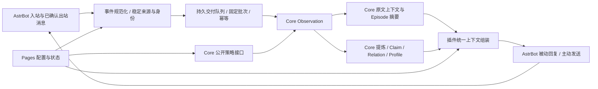

# dev.4 薄层接入与 v3 功能整合计划

日期：2026-09-08。状态：**仅计划，尚未实施**。

本轮要求：所有消息全量进入 Observation；插件尽量作为薄层；基本覆盖或优化整合 v3 的功能；每项功能在 Pages 有独立开关。本文确定后续工作的范围、顺序和验收方式，不授权开始实现。

## 1. 工作区与核查基线

- 已先将插件原有实现、未提交文档保存为本地检查点 **`4a8e0d0`**，分支仍是 `dev.4`。该提交只是保存既有成果，不表示本轮实现或重新验收了这些功能。
- `.local-backups/`、`.venv/` 和忽略的运行缓存保持原样，不删除恢复材料。工作区“干净”指受版本控制的改动和未跟踪交付文件已归档。
- v3 对照固定为 **`3.2.0` / `b752ffb`**，通过 `git show` 只读核查，不切换分支。
- Core 在相邻仓库 `main` 的 **`7629152` 加正在变动的工作区**上改造。本轮只读核查，不提交、暂存、清理或改动 Core 文件，也不把该仓库称为干净。
- 本轮后续只修改 Markdown 计划及导航；不修改业务代码、Pages 实现、依赖或数据库，不运行迁移、不发布。

本计划与[功能及开关矩阵](V4_FEATURE_SWITCH_MATRIX.md)是这轮的总入口。此前的 [Observation 专项方案](V4_OBSERVATION_REVISION_PLAN.md)保留事件/身份细节，[v3 对照](V4_V3_FUNCTION_COMPARISON.md)保留实际缺项证据，[技术路线](V4_TECHNICAL_ROADMAP.md)保留总体约束。有冲突时，以本轮用户要求和本计划为准；不能继续把表达学习、群聊陪伴等简单视为不做。

## 2. 目标及不变量

### 2.1 全量的确切含义

在 Pages 启用的接入范围内，**宿主实际收到的所有消息，以及可确认实际发出的消息，都进入同一 Observation 链路**。是否触发回复、是否有记忆价值、是否启用检索/学习/主动功能，不影响原始事件采集。

1. 覆盖直接交互、未 @ Iris 的背景讨论、私聊、群聊、命令、重复发言、纯 @、无文本媒体和可读取的引用/转发结构。原始消息不经过相关性打分、关键词筛选或模型判断。
2. 一个来源的采集开关是整体开关；不再用“只记录触发回复的消息”作为默认策略。`context_kind=interaction/background` 只是用途元数据，不是采集过滤器，也不通过入库后重新分类重复写同一事件。
3. 首次安装保持接入总开关关闭；用户开启“全量接入”后，默认接纳已连接平台可见的所有来源，并允许按来源明确排除。升级已有安装时保留旧授权来源，Pages 显示迁移预览，不能悄悄把旧白名单扩大为全部会话。
4. “全量”约束完整接收和可追踪交付，不代表模型窗口无限、永久保留或平台不可见历史也能恢复。后台摘要、长期提炼、上下文采用、主动发送分别控制。
5. 按 core 当前改造方向，背景 Observation 默认保留 30 天，可在 Pages 配置或关闭自动到期清理；有效摘要/记忆引用与 Hold 阻止普通到期删除，主动遗忘仍按 Core 删除规则执行。不会照搬为所有交互消息 30 天删除。
6. 图片描述、转写、摘要等派生内容保留生成者与源引用，使用 Core 公共支持的派生表示，不改写原文、不冒充用户发言。图片理解关闭时，原始图片消息及宿主可用的附件信息仍入库。
7. 不同参与者同一句话、同一人多次刷屏仍是多个真实事件；只按来源事件身份去重。提示词清理与呈现压缩只作用于模型视图，不能修改原始观察。

助手输出按平台证据分级：模型生成结束不等于发送；只将 Core 契约认可的已确认效果提交为 committed。平台仅返回 accepted、发送失败或结果未知时，保留对应回执，不伪造送达。原始出站事件与平台回显必须能关联去重。缺少效果 Hook 的平台明确显示接入不完整，不能宣称已经覆盖助手消息。

### 2.2 薄层的职责边界

| 责任 | 唯一主责 | 插件保留的工作 |
| --- | --- | --- |
| 原始消息、摘要、事实、关系、画像、检索索引、删除与派生失效 | Core | 通过公共接口交付、读取、呈现和管理 |
| 自动总结、提炼、记忆协调、遗忘策略及处理水位 | Core | Pages 编辑受授权策略、展示执行状态；本地驱动有界维护批次 |
| 身份、Agent/Space 授权与候选证据校验 | Core | 平台身份规范化、持久绑定引用、版本检查与发送路由 |
| 插件完整人格、草稿、审批、发布历史 | 插件 | 单一人格主记录；AstrBot 执行镜像、Core 发布镜像 |
| 插话/跟进的产品策略和实际发送 | 插件 | 小型门控、统一决策、上下文及发送；Task/Focus 正文和状态留在 Core |
| 表达/黑话候选、相关来源与记忆有效性 | Core 公共表示，待明确 | 学习目标、审查/批准流程和采用策略；不再存第二份聊天样本库 |
| 平台媒体获取及可选模型调用 | 插件借用宿主能力 | 有界媒体缓存、来源关联及 Provider 桥接；不维护独立媒体记忆库 |
| 配置、交付、发送回执、有限运行记录 | 插件 | 一个 SQLite；ACK 后清除交付正文，保留有限回执 |

不重新建立 L1/L2/L3 三套存储、独立画像库、独立黑话事实库或另一套梦境引擎。薄层可以有宿主必需的交付状态和产品逻辑；判断标准是是否重复拥有 Core 的领域数据和计算责任，不能只看代码行数。

## 3. 当前差距和 Core 接缝

### 3.1 已核实的插件差距

| 代码入口 | 当前行为 | 计划变化 |
| --- | --- | --- |
| `main.py:observe_message` / `modules/memory.py:capture` | 依赖 memory 模块和允许会话；只传文本，空文本忽略 | 接入成为独立能力，完整事件先落交付队列，媒体解析另行启用 |
| `main.py:report_context` | LLM 响应只报告 Recall Usage | 增加经过真实发送效果验证的出站观察链路 |
| `modules/memory.py:_drain` / `outbox.py` | 每轮最多取 8 条，逐条请求、固定等待；过期行可能直接删除 | 有界真实批处理；冻结请求、保留未确认事件；压力和缺口可见 |
| `identity.py` / `backends.py` | 会话/人格组合创建 Agent，远程禁止共享 Agent | 持续主体对应 Agent，来源对应 Space，人格 revision 不改变主体 |
| `modules/context.py` | 排除全部 Observation | 公共原文上下文＋Episode＋Recall 统一预算和来源去重 |
| `host.py:providers` | 本地 cognitive Provider 被 Scope 缺口阻止 | 只在 Core 候选绑定及安装物通过后接入，不在插件猜 Scope |
| `config.py:MODULES` / `control.py:apply` | 8 个模块粗开关；配置更新停启所有模块 | 功能开关与共享服务生命周期分离，按变更影响范围应用 |
| `modules/proactive.py` / `learning.py` / Pages | 缺群聊插话、完整跟进、表达/黑话、数据管理等 | 依据功能矩阵逐项恢复用户能力，复用统一服务 |

### 3.2 新 Core 改造应如何消费

以下只是 **2026-09-08 工作区源码核查**，不是已发布或已验证的依赖承诺。实施 W0 必须重新冻结版本、源码提交、wheel 摘要、能力和双入口用例。

| 接缝 | 本轮所见 | 插件计划与阻塞边界 |
| --- | --- | --- |
| Observation 增量字段 | `context_kind`、`source_thread_id`、`reply_to_source_event_id` 已出现于领域对象和契约 | 优先消费正式字段；不把旧提案中的任意 interaction JSON 当作已支持 |
| 原文与摘要查询 | `observation-context.v1`；Embedded/SDK 的 `observation_context()`；`readObservationContext` 与 `/v1/observations:context` | 作为近期上下文主要入口；旧 `recent-context.v1` 不能代替新能力检查 |
| 显式批量摘要 | `summarize_observations()`、`summarizeObservationContext` 与 `/v1/observations:summarize` | 页面只入队和读状态，读取页面/上下文不得顺带调用模型 |
| 自动摘要与保留 | `auto_summary_enabled` 默认 false；数量/等待/批大小；`background_retention_days` 默认 30，配置允许 0 | 映射 Pages；正式冻结 0 的关闭语义和参数上限，查询实际生效配置 |
| 配置应用方式 | 当前 `EmbeddedConfig` 是不可变实例配置；未据此确认有等价的远程动态策略接口 | 本地可能需要排空后重建同一 Runtime；远程/按 Space 开关需 Core 公共可写策略，否则显示阻塞 |
| 多 Space 与批量身份 | 当前仍见 `provision_agent`、`register_actor`；未确认独立 `provision_space` 已交付 | 可先用旧映射验证全量消息闭环，多 Space 升级单独受门禁约束 |
| 多人认知和 Scope 绑定 | 现有异步 `_Cognitive` 未见与 HTTP 等价的候选 Scope 绑定 | 摘要接口新增不等于此缺口关闭；多人事实提炼单独验收 |
| 精细派生策略 | 未确认提炼、画像、关系、梦境阶段均可独立控制 | 提交消费方接口需求，不能靠关闭整个 worker 冒充关闭单项业务 |
| 学习、图谱编辑、范围遗忘、备份恢复 | 现有 Core 领域/管理能力需逐项映射，不能按名称推断完整覆盖 | 冻结可用公共操作、凭据和 Scope；缺口保持可见，插件不读私库补齐 |

Core 需要明确的消费方最小合同：功能目录与授权、策略读写及版本号、生效范围（运行实例/Agent/Space）、排队及在途任务的关闭语义、实际执行状态、失败分类。本地与远程使用同一业务含义。对于实例级配置，Pages 只能显示实例级控制；在 Core 支持前不能伪造会话级覆盖。

## 4. 关键链路设计

### 4.1 接收、交付与压力处理

1. 在宿主能够提供的最早、不会仅限唤醒消息的 Hook 中规范化事件。核查 Hook 优先级、其他插件终止事件、忽略自身消息及平台回显行为。
2. 保存原始正文/结构、平台事件时间与接收时间、来源事件身份、发言者、回复引用、主体/来源绑定版本。无可靠事件时间时使用接收时间并标明来源；无平台消息 ID 时只能保证已持久接收事件的重试幂等。
3. 同一个短事务完成交付记录与去重标记；首次请求前冻结解析后的 Scope、事件体、批次成员、请求指纹及幂等键。更改人格或绑定不重归属旧事件。
4. 按相同 Scope/授权语义组成受 Core 上限约束的批次，消息各自独立。数量、字节和最长等待只决定何时发送，不能决定是否记住原文。
5. ACK 后保存观察引用与提交水位并清除临时正文；投影、摘要扫描处理、摘要实际覆盖和事实提炼各自展示，不混成“已记忆”一个状态。
6. 结果未知使用原请求/原键重试或对账，不能换键、换 Scope 或拆批；确定拒绝后才按 Core 事务合同隔离坏记录。持久批次状态支持崩溃恢复。
7. **取消现有未 ACK 消息按 TTL 静默删除的策略。** 到期只转为可见的待处理/隔离状态；普通保留期只适用于 Core 已接收数据。来源停用暂停旧队列并保留归属；重新开启需授权仍有效。明确删除走单独管理操作。
8. 内存及磁盘交付队列均有界。达到高水位先加快有界批交付和限制富媒体派生；满载时尽可能对宿主施加背压。宿主无法重投时记录“未持久接收”的数量/区间并提示接入缺口，不伪报成功、不覆盖旧未确认消息。
9. 超长正文/超大结构不能静默截断。优先使用 Core 支持的分段或附件引用合同，保留单个源事件与分段关系；未有合同则明确隔离并列为覆盖缺口。消息编辑/撤回同样等待公共修订/删除合同，不覆写旧幂等请求。

### 4.2 原文上下文、摘要和长期记忆

- 近期部分使用新的 `observation_context()`；长期部分使用 Recall。按当前 Agent、Space、可选 Session 和用途取有界结果，保留快照、游标、后续页与截断原因。
- 系统/人格/工具/宿主历史/当前输入先占预算，再分配原文、摘要、长期记忆、画像和学习材料；类别空缺可让出预算，只在一个组装器中决策。
- 以来源事件、Observation ID/revision、摘要覆盖引用与宿主可验证映射去重，不用正文相同认定重复。固定快照下有限翻页，不能为“全量入库”把所有历史塞入模型。
- 保留发言者、时间及必要回复链；当前有效事实优先于历史发言，旧原文不是新的有效 Claim。跨 Space 原文默认不共享，主动启用长期共享也必须经过 Core 授权策略。
- 查询新写入消息采用正式 read-your-writes/最低水位合同；未获支持或超时则显式部分结果，不能悄悄假定投影已经追上。当前用户输入继续由宿主携带。
- Recall 候选按正式 Usage 合同反馈。新原文查询若没有 candidate ID 或 Usage 入口，只记插件选择诊断，**不伪造 Recall 候选 ID**；这是对旧专项方案“所有选择仍走 Usage”的收紧。
- 每个注入类别独立开关；关闭近期注入仍能采集和后台总结，关闭自动总结仍能读原文及已有摘要，关闭注入不删除历史数据。

### 4.3 主动陪伴与学习

主动侧用一套流程覆盖 v3 的 `chime_in / follow_up / initiate / watch`：来源开关及静音/冷却/滚动限额 → 轻量信号门控 → 必要时一次有界决策 → 公共上下文生成 → 发送前重验 → 回执与 Observation。门控筛选只影响发言决策，不能筛掉消息采集。

插话、事件跟进、群聊静默发起、私聊关心、被动回复后观察评估、确定性任务提醒分别开关。Focus/Task 存 Core；插件只保留有限门控和发送状态。关闭一个动机不会顺带关闭其他动机，所有主动发言共同服从主动发送总闸。Task 提醒继续可以零模型执行。

学习分为人格演进、表达模式、黑话和对话样例，采样/生成与采用分开。所有样本使用 Core 来源引用及版本；插件保存草稿、Diff、审查和审批状态。人格默认人工发布，自动发布另设开关。表达/黑话公共类型及删除传播未明确前保持外部阻塞，不把任意字符串写进 Note 就称为完整学习系统。

检索查询改写、图片理解、学习审查、主动决策等额外模型调用共用预算与限并发；自动摘要/提炼的调度和候选校验仍属 Core。本地共享宿主模型预算时，每次实际调用只计费一次；远程 Core 预算与插件预算分列。页面读取、状态查询、原始采集和关闭中的功能不触发额外模型调用。

## 5. Pages 独立开关的实施合同

完整功能清单和拟定键见[功能及开关矩阵](V4_FEATURE_SWITCH_MATRIX.md)。每个键都是独立布尔控制；阈值、数量、间隔不是开关的替代物。

### 5.1 单一功能目录

在插件配置层定义轻量功能描述：稳定 ID、中文名称、默认值、可覆盖范围、前置依赖、Core 能力/授权、配置归属、应用方式、关闭行为。Pages、API、Hook、LLM 工具和后台工作消费同一目录，避免“页面关了但后台还在运行”。拟定键是设计，不是当前已存在配置。

功能开关与运行服务分开：传输 Backend、交付队列、上下文组装、预算、Core 有界维护等共享服务按依赖复用；关闭记忆检索、梦境或画像不关闭其他功能所需的 Core 连接、删除传播或交付 worker。保留一个插件业务总停用入口，Pages 和必要的恢复/停止状态仍可访问。

总停用拟用 `plugin.enabled`，上下文采用总闸拟用 `context.enabled`；它们与矩阵中的子项共同决定效果，重新开启总闸恢复已保存的子项意图，不把全部子项改成开启。基础 Pages 管理始终可访问。

### 5.2 状态和生效规则

- 区分用户希望开启、依赖满足、已应用修订和实际生效；页面显示“关闭 / 运行中 / 应用中 / 等待依赖 / Core 不支持 / 无权限 / 待重载 / 失败”。
- 普通功能提供全局默认及可支持的主体/来源覆盖（继承/开/关）。人格按主体，主动按来源；Core 策略只能覆盖其实际支持范围。全局与来源总停用不可被下级覆盖。
- 开启依赖不满足的功能时，Pages 给出依赖和可审阅的联动变更；保存不能静默打开其他模型或主动功能。服务依赖可自动复用，用户功能意图不自动改写。
- 更新采用配置版本 CAS；与 Core 的策略修订分别记录。跨插件/Core 不假装一个 SQLite 事务：校验 → 应用并回读 → 标记有效；失败显示不同步，必要时按原修订回退，不显示虚假成功。
- 只排空受影响工作；新 generation 阻止旧主动发送、旧草稿发布和旧配置任务进入下一效果阶段。在途 Core 工作按公共取消/排空合同处理，无法立刻停止时显示“正在停止”直到确认。
- 关闭接入不等于删除；关闭后台加工不阻断原始交付；关闭维护业务不关闭 Core 基础作业；关闭画像采用不等于关闭画像更新。
- 所有功能入口在服务端复查当前开关、来源、授权和修订。隐藏工具/禁用按钮只是界面表现；旧工具调用、手工 API 请求和已排队工作同样受约束。
- 模式选择仍只在 AstrBot Schema 保留 `core_mode`；其余配置在 Pages。模式变更、需重建 Runtime 的参数明确提示应用方式，不承诺全部热改。

### 5.3 页面组织

| 页面 | 主要内容 |
| --- | --- |
| 概览与功能 | 所有独立开关、有效状态、依赖、预算、差异；按模块分组，可搜索 |
| 来源与主体 | 自动发现来源、启用/排除、主体/Space 绑定、采集/采用/主动策略 |
| 观察与上下文 | 原始消息、作者/时间、回复来源、摘要、覆盖/处理进度、交付缺口 |
| 记忆、关系与画像 | Recall、纠正、遗忘范围、图谱及用户/群画像；对应生成/采用开关 |
| 主动与任务 | 各动机开关、Focus/Task、静音冷却、发送与跳过原因 |
| 人格与学习 | 完整人格、表达/黑话/样例、采样范围、草稿/Diff/审查/批准/发布 |
| 维护与数据 | 梦境各阶段、保留期、索引、备份恢复、迁移预览与作业进度 |
| 运行与成本 | 插件/Core 分列统计、模型类别、详细日志及正文开关、错误关联 |

保留原生 JS/CSS 和宿主 Pages 桥接；按功能拆分前端文件即可，不引入新的常驻 Web 服务。页面用用户能理解的功能名，内部键和协议细节放诊断视图。

## 6. 后续实施工作包

当前只完成计划和工作区归档；**下表所有实现工作包均未开始**。每包包含相应 Pages 开关和定向验收，不能先上线行为、最后再补控制。

| 工作包 | 交付范围 | 依赖与完成条件 |
| --- | --- | --- |
| W0 契约与覆盖冻结 | Core 能力/安装物清单，v3 功能逐项映射，真实平台 Hook/效果矩阵、开关归属 | 固定可复现依赖，列出外部阻塞和明确范围；未确认能力不进入承诺 |
| W1 功能目录与 Pages 基座 | 独立开关、范围覆盖、有效状态、服务依赖、CAS 和增量应用 | 通过后端/API/工具/后台一致性用例；旧配置迁移预览；不改变授权来源 |
| W2 全量 Observation | 完整入站/确认出站、冻结事件与批次、有界交付恢复、来源/主体映射 | 无模型全量闭环；非文本、未触发、重复、乱序、重启和满载有明确证据。多 Space 子项受 Core 注册接口门禁约束 |
| W3 上下文与自动沉淀 | 新上下文查询、宿主去重、摘要开关/策略、Provider 桥接、长期 Recall | 背景讨论可被后续回答；摘要与 Claim 提炼分别验收，不互相冒充完成 |
| W4 记忆能力与数据基础 | 关系/画像/好感度、检索优化、范围删除、手动备份恢复及索引入口 | Core 支持的能力真正接通；纠正/遗忘不复活、快照可恢复；缺项公开记录 |
| W5 主动陪伴 | 插话、跟进、群/私聊发起、watch、提醒与统一发送 | 各动机能独立开关；关闭或新消息到来阻止过期发送；回执不冒充送达 |
| W6 学习和平台功能 | 人格演进全流程、表达/黑话/样例、媒体复用、引用/转发、输出辅助和旧工具/命令兼容 | 每项能说明 v3 输入场景、新行为、开关和效果；不能只保留空入口 |
| W7 维护、迁移与替代验收 | 梦境五阶段及保留策略、自动备份、v3→v4 导入预览/执行/回退、质量与长稳 | 使用新数据和迁移数据回放；固定目标机器做性能和真实宿主验收，更新差异清单 |

W2 的无模型全量接入与 W3 的原文查询可以先验证，不必等所有多人认知能力。W4/W6 的 Core 新公共接口需求应在 W0 就列出，避免临到功能实施再发现无法保持薄层。现有功能的可靠性保护贯穿各包。

预计文件职责：`config.py`/`control.py`/`api.py` 与 Pages 承担 W1；`identity.py`、轻量事件规范化模块、`main.py`、`outbox.py`/`backends.py` 承担 W2；`modules/context.py`/`memory.py` 与 `host.py` 承担 W3/W4；`modules/proactive.py` 承担统一主动链路；`personas.py`、`modules/learning.py`/`media.py` 及按需拆分的流程文件承担 W6；`modules/maintenance.py` 和管理 API 承担 W7。新文件只按清晰职责增加，不为每个开关创建独立模块或 worker。

分阶段版本措辞：W2/W3 可称“全量观察闭环候选”；W5 后可称“主要陪伴候选”；W6/W7 和功能矩阵缺项处理完成前，不能称为 v3 的完整替代。用户要求的功能不因阶段靠后被默认为取消。

## 7. 验收设计

本轮不执行实现测试。后续只针对实际变化运行必要检查，最终替代验收再扩大到完整场景。

| 场景 | 可核验结果 |
| --- | --- |
| 无模型、各衍生功能关闭 | 所有范围内入站/确认出站事件入库；没有逐条模型调用；非文本消息有结构化记录 |
| 两人未 @ 的讨论，第三人随后询问 | 不依赖宿主已有那段历史，正确引用发言者和时间；当前输入不重复注入 |
| 同文不同人、同源重放、跨群同号、缺 ID、乱序和迟到引用 | 前者分别保留，重放不重复；不足以去重的情况如实标记；未确认事件不因 TTL 消失 |
| 网络超时、写入后断连、排队后切人格/配置、进程中断 | 同一请求/键可恢复；不串 Scope、不重复消息，ACK 与加工进度分开 |
| 图片解析关闭、超长消息、引用/合并转发 | 原始事件仍接收；派生不调用模型；不支持的大小/结构明确计入缺口，不能静默截断 |
| 助手生成未发送、部分发送、发送未知、平台回显 | 只提交合法确认效果；回显不重复，未知结果不盲重发、不生成虚假承诺 |
| 自动摘要关闭/开启，消息数量/等待触发 | 关闭零自动摘要调用；开启有界批量、真实来源引用、重启不重复，忽略源与被引用源保留策略不同 |
| 两人分别说“我喜欢……”；身份或来源在模型运行时变化 | 事实主体正确，来源失效/扩权候选不提交；摘要新增不掩盖提炼 Scope 缺口 |
| 原文、摘要、已纠正事实和宿主历史重叠 | 总预算有界、引用可解释，旧原文不覆盖新事实；删除后派生读取不复活 |
| 逐项关闭功能，经 Pages/API/工具/已排队任务触发 | 每个矩阵键有对应断言；实际相关模型、注入、调度或发送停止，独立功能继续正常 |
| 单一功能与典型组合 | 至少覆盖：只采集、只读已有记忆、只提醒、只人格、采集＋上下文、全开后逐项关闭、依赖失效、热重载 |
| 本地/远程策略不同步或能力不足 | UI 显示真实有效状态、授权和重载要求；不能由插件布尔值冒充远程已关闭 |
| 群聊插话、用户跟进、静默发起、私聊关心、学习审查 | 相同 v3 案例有可用结果；错误触发、重复发言及自动发布边界可重现 |
| 备份、恢复、范围遗忘和 v3 导入 | 预览准确，完整引用/绑定可恢复；导入幂等，旧库不覆盖，删除账本不被恢复绕过 |

先在同一安装快照上运行 Embedded 与 SDK→真实 HTTP→Core 的同场景测试，再验证真实 AstrBot 平台。中文多人、别名、时间、纠正、无答案、主动打扰率、人格一致性需固定样本与模型对照 v3，不能以测试数量推算功能覆盖率或效果提升。

性能至少记录：消息持久接收率、缺口、队列增长/清空时间、Observe P95、回复额外延迟、内存/磁盘峰值、每类模型次数和 Token。可用 1/20/100 条每秒作输入档位，W0 按目标机器冻结通过线；不是当前吞吐承诺。24 小时长稳、故障恢复、依赖隔离和真实平台效果均单独保留证据。

## 8. 数据、兼容与本轮交付界限

旧 dev.4 的 Agent/Space 映射和 v3 数据不自动合并。升级预览需列出主体、来源、人格、Task/Focus、身份和授权的变化；Core 不支持跨 Agent 历史迁移时保留旧绑定，新来源采用新映射，不能直接修改数据库外键。

v3 迁移按原数据的证据等级导入：可验证原始事件、旧摘要、旧显式记忆分别处理；旧画像/黑话/关系若缺来源，保留 legacy 标识，不能伪造新的用户 Observation 充当来源。配置、人格主记录、插件路由与 Core 数据使用一致快照清单和版本，远程使用受授权公开导出/恢复流程，不复制服务端数据库文件。

“基本覆盖”按用户能力核对，而非复制 v3 模块名称或所有内部调参项。允许优化实现和合并入口；不得用 worker、Focus 存储或任意 Note 的存在替代梦境效果、跟进发言或完整学习。未实现、外部阻塞、平台不支持和有意替代必须分列。

本轮产物是本文、功能矩阵和旧方案导航修订。只做文档一致性、链接和差异检查；保持插件 Git 工作区干净，不推送，不改动 Core 的在途工作。
